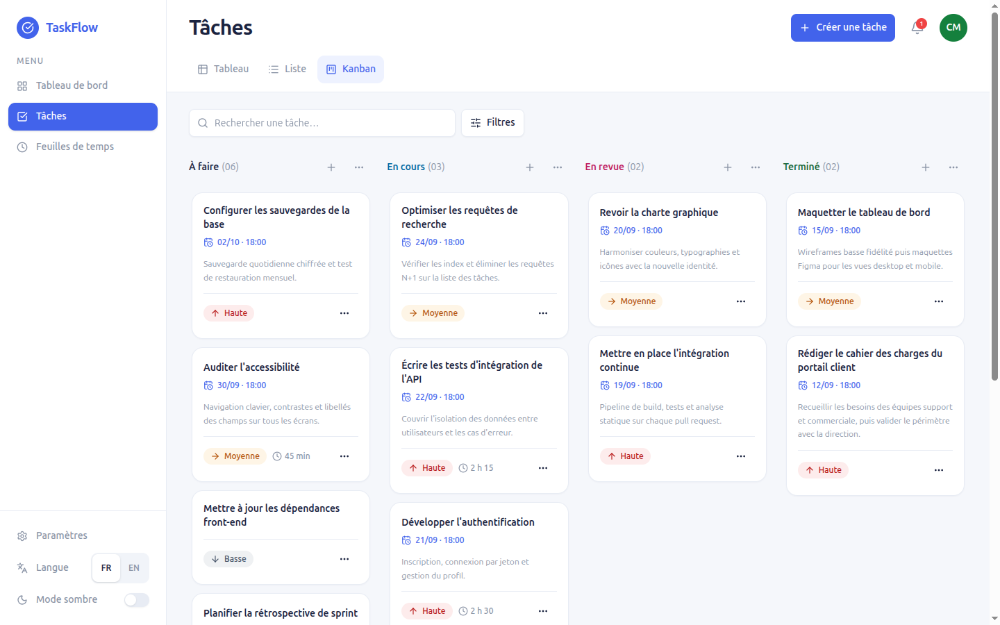
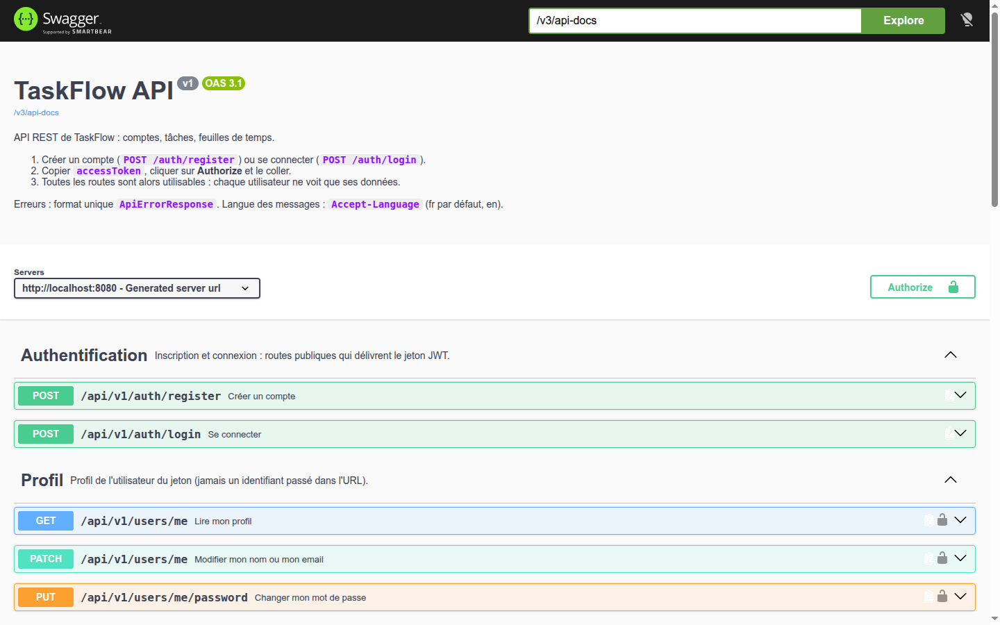
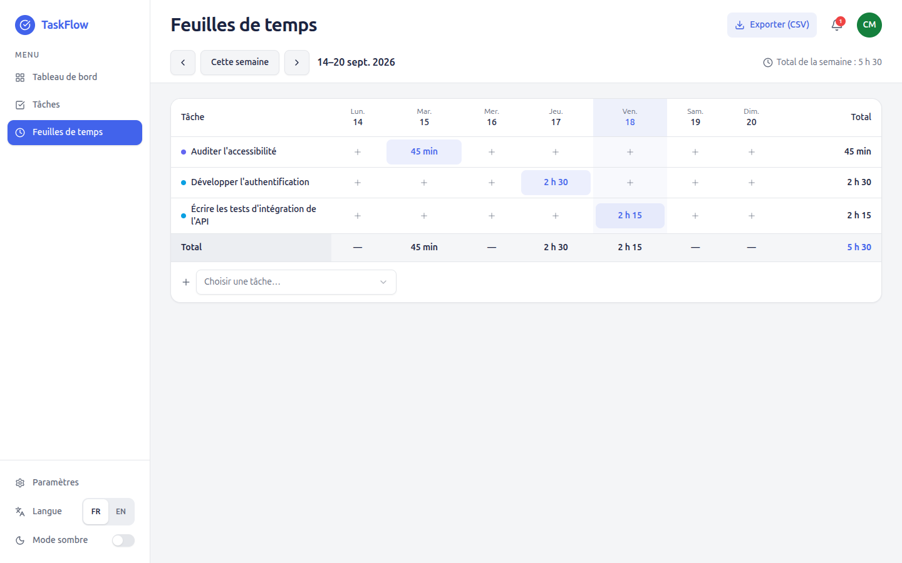
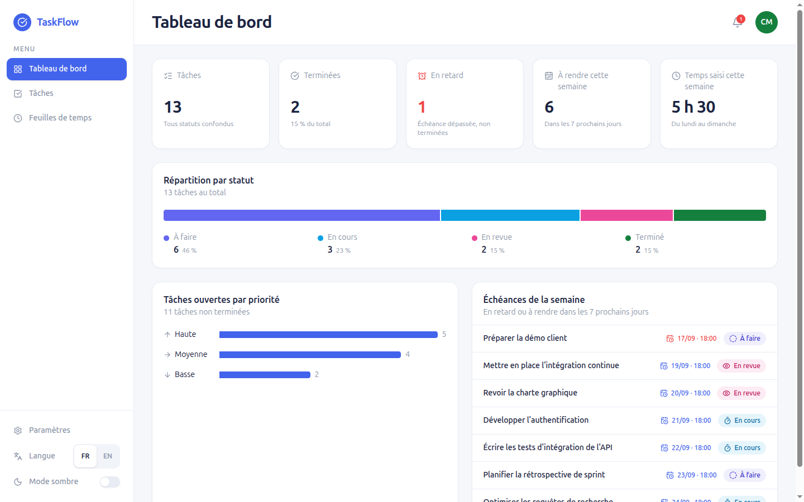
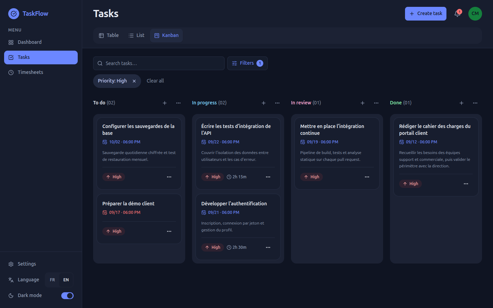
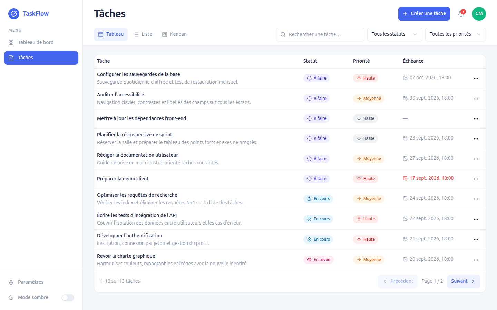
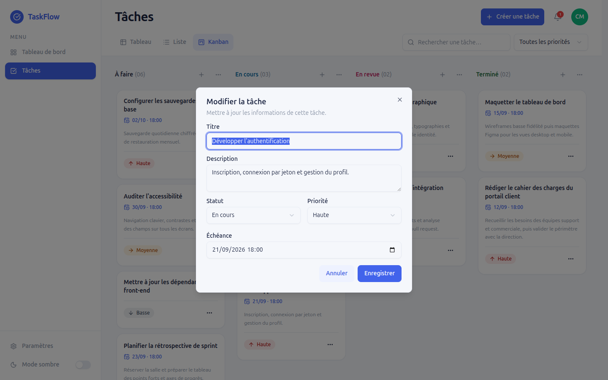
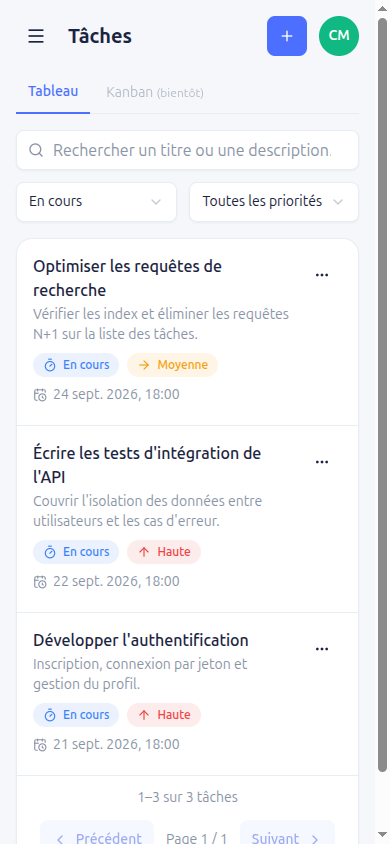
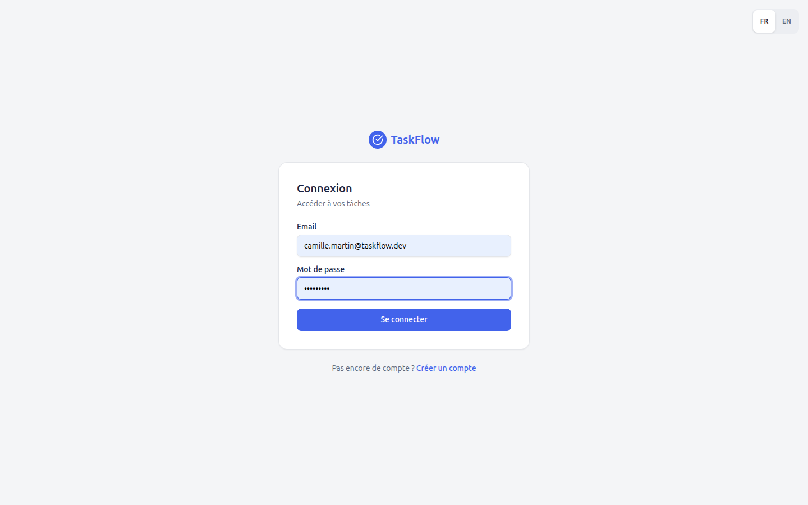

# TaskFlow

[](https://github.com/Djsk-f/taskflow/actions/workflows/ci.yml)

Application web de gestion de tâches personnelles : chaque utilisateur crée un compte,
se connecte, puis gère **ses** tâches — tableau Kanban, recherche, filtres, pagination —
et **le temps qu'il y passe** grâce aux feuilles de temps. Interface responsive,
en français et en anglais, en thème clair ou sombre.

- **API** : Java 21 · Spring Boot 4 · Spring Security + JWT · JPA / Hibernate · MySQL 8 · Flyway · OpenAPI (Swagger UI)
- **Interface** : React 19 · TypeScript · Vite · Tailwind CSS 4 · shadcn/ui (Radix) · TanStack Query · dnd-kit · i18next



---

## Sommaire

1. [Fonctionnalités](#fonctionnalités)
2. [Stack technique](#stack-technique)
3. [Prérequis](#prérequis)
4. [Installation et lancement](#installation-et-lancement)
5. [Variables d'environnement](#variables-denvironnement)
6. [API REST](#api-rest)
7. [Architecture](#architecture)
8. [Choix techniques et justifications](#choix-techniques-et-justifications)
9. [Sécurité](#sécurité)
10. [Tests et qualité](#tests-et-qualité)
11. [Captures d'écran](#captures-décran)
12. [Limites connues](#limites-connues)

---

## Fonctionnalités

| Domaine | Ce que fait l'application |
|---------|---------------------------|
| Compte | Inscription, connexion par JWT, session restaurée au rechargement, déconnexion |
| Profil | Modification du nom et de l'email, changement de mot de passe (mot de passe actuel exigé) |
| Tâches | Création, modification et suppression (avec confirmation) — titre, description, statut, priorité, échéance |
| Kanban | Vue par défaut : une colonne par statut avec compteur ; **glisser-déposer** à la souris, au doigt ou au clavier pour changer le statut ; `+` pour créer directement dans une colonne ; menu « Déplacer vers » sur chaque carte ; compte neuf accueilli par « Créer ma première tâche » |
| Terminer | Case « terminée » en un clic sur chaque carte et chaque ligne (un second clic rouvre la tâche) ; tout changement de statut propose **« Annuler »** pendant 8 s |
| Vues | **Kanban · Grille · Liste**, mémorisées dans l'URL avec les filtres et le tri |
| Tableau de bord | Chiffres clés cliquables (« 3 en retard » ouvre ces 3 tâches), répartition par statut, tâches ouvertes par priorité, échéances de la semaine |
| Notifications | Cloche de l'en-tête : tâches en retard ou à échéance dans les 24 h |
| Mode sombre | Interrupteur dans la barre latérale ; suit la préférence du système par défaut, choix mémorisé |
| Notifications | Messages de succès et d'erreur colorés selon leur type (vert, rouge, orange, bleu) |
| Liste et tri | Uniquement les tâches de l'utilisateur connecté, **ce qui presse d'abord** (échéance la plus proche ; sans échéance, puis terminées, en dernier) ; en-têtes de la grille cliquables (titre, statut, priorité, échéance) et menu « Trier » dans toutes les vues ; priorité et statut triés dans leur ordre métier, pas alphabétique |
| Recherche | Insensible à la casse, sur le titre **et** la description, déclenchée 300 ms après la frappe |
| Filtres | Bouton « Filtres » : pastilles de priorité (`Basse`, `Moyenne`, `Haute`), de statut (`À faire`, `En cours`, `En revue`, `Terminé`) et d'échéance (`En retard`, `Cette semaine`), filtres actifs en étiquettes supprimables, cumulables avec la recherche |
| Feuilles de temps | Saisie du temps passé sur une tâche (« 1h30 », « 45m », « 2 »…) ; grille hebdomadaire tâches × jours avec totaux par tâche, par jour et pour la semaine ; navigation d'une semaine à l'autre ; export CSV compatible Excel ; temps total affiché sur chaque tâche |
| Langues | Français et anglais : langue du navigateur au premier accès, puis choix mémorisé ; les messages d'erreur de l'API suivent la langue |
| Pagination | Adaptée à chaque liste : **tableau et liste** paginés (pages numérotées, 10 / 20 / 50 par page, mémorisé dans l'URL) ; **colonnes Kanban** par lots de 10 (« Afficher 10 de plus · N restantes ») ; **échéances du tableau de bord** 5 par page ; **cloche** limitée à 5 par groupe avec accès à la liste complète ; **historique de temps** par lots de 5 ; ajout d'une tâche à la feuille de temps par **recherche** (10 suggestions) plutôt que par une longue liste |
| Erreurs | Format d'erreur unique côté API ; messages du serveur affichés sous les champs ou dans le formulaire ; écran « Réessayer » si le serveur est injoignable ; **session expirée** : message explicite, retour à la page quittée (filtres compris) et saisie en cours rendue ; fermer un formulaire modifié demande confirmation |
| Responsive | Colonnes Kanban défilantes et menu en tiroir sur mobile, grille remplacée par des cartes, chiffres clés sur deux colonnes ; cibles tactiles ≥ 40 px |
| Accessibilité | Lien « Aller au contenu », navigation complète au clavier, mot de passe affichable, en-têtes de tri annoncés (`aria-sort`), focus rendu à la fermeture des fenêtres, annonces vocales du glisser-déposer, contrastes de texte ≥ 4,5:1 (WCAG AA) en clair comme en sombre |

Les filtres et la page courante sont portés par l'URL : un lien filtré se partage et le
bouton « retour » du navigateur fonctionne. Une échéance dépassée est signalée en rouge.

---

## Stack technique

| Couche | Technologie | Version |
|--------|-------------|---------|
| Langage serveur | Java | 21 |
| Framework | Spring Boot (Web MVC, Security, Data JPA, Validation, Actuator) | 4.1.1 |
| Jetons | JJWT | 0.12.6 |
| Documentation d'API | springdoc-openapi (OpenAPI 3.1, Swagger UI) | 3.1.1 |
| Base de données | MySQL (via Docker) | 8.4 |
| Migrations | Flyway | géré par Spring Boot |
| Tests serveur | JUnit 5, Mockito, Spring Boot Test, H2 (en mémoire) | gérés par Spring Boot |
| Interface | React | 19 |
| Langage client | TypeScript | 6 |
| Outillage | Vite | 8 |
| Styles | Tailwind CSS | 4 |
| Composants | shadcn/ui sur Radix UI, icônes lucide-react | — |
| Glisser-déposer | dnd-kit | 6 |
| Traduction | i18next, react-i18next | 26 / 17 |
| État serveur | TanStack Query | 5 |
| Formulaires | react-hook-form + Zod | 7 / 4 |
| Routage / HTTP | React Router, axios | 7 / 1 |

---

## Prérequis

| Outil | Version | Vérification |
|-------|---------|--------------|
| JDK | **21** | `java -version` |
| Node.js | **20.19+** ou **22.12+** (exigé par Vite 8) | `node --version` |
| Docker + Docker Compose v2 | récent | `docker compose version` |

Pour le **lancement tout-Docker** (option A), seul Docker est nécessaire.
Java et Node ne servent qu'au développement local (option B). Maven n'est pas nécessaire :
le dépôt fournit le wrapper `mvnw`.

Ports utilisés : **3000** (application en Docker), **3306** (MySQL), **8080** (API),
**5173** (interface en développement).

---

## Installation et lancement

Toutes les commandes partent de la racine du dépôt. Deux façons de lancer l'application :

- **Option A — tout en Docker** : une commande, rien d'autre à installer. Pour essayer l'application.
- **Option B — développement local** : API et interface lancées hors conteneur, avec rechargement à chaud.

La configuration (étape 1) est commune aux deux.

### 1. Configurer l'environnement

```bash
cp .env.example .env
```

Générer un secret JWT (48 octets aléatoires, en base64) :

```bash
node -e "console.log(require('crypto').randomBytes(48).toString('base64'))"
```

puis remplacer la valeur de `JWT_SECRET` dans `.env` par le résultat.
Les autres valeurs par défaut fonctionnent telles quelles en local.

> L'API **refuse de démarrer** si `JWT_SECRET` est absent ou trop court : c'est voulu.
> Sans Node, un secret s'obtient aussi avec `openssl rand -base64 48`.

### Option A — Tout en Docker

```bash
docker compose up -d --build
```

Le premier lancement construit les images (quelques minutes : téléchargement des
dépendances Maven et npm). Les trois services démarrent dans l'ordre — MySQL, puis l'API
une fois la base prête, puis l'interface une fois l'API prête :

```bash
docker compose ps        # mysql et api « healthy », web « Up »
```

Ouvrir **http://localhost:3000** et se connecter avec le **compte de démonstration**,
créé automatiquement au premier démarrage (35 tâches, deux semaines de feuilles de temps) :

| Email | Mot de passe |
|-------|--------------|
| `camille.martin@taskflow.dev` | `Demo2026!` |

On peut aussi créer son propre compte. Pour démarrer sur une base vide : `APP_DEMO_DATA=false` dans `.env`.

L'interface est servie par nginx, qui relaie aussi les appels `/api` vers l'API : pour le
navigateur, tout vient de la même origine. L'API reste joignable directement sur
http://localhost:8080.

```bash
docker compose logs -f api   # suivre les journaux de l'API
docker compose down          # arrêter (les données sont conservées)
docker compose down -v       # arrêter et effacer la base
```

> Un port est déjà pris sur votre machine ? Changer `WEB_PORT`, `SERVER_PORT` ou `DB_PORT`
> dans `.env`.

### Option B — Développement local

Prérequis supplémentaires : JDK 21 et Node.js (voir [Prérequis](#prérequis)).

#### 2. Démarrer MySQL seul

```bash
docker compose up -d mysql
```

Attendre que le conteneur soit `healthy` (une trentaine de secondes au premier lancement) :

```bash
docker compose ps
```

> Le port 3306 est déjà pris sur votre machine ? Mettre par exemple `DB_PORT=3307` dans
> `.env` : Docker et l'API lisent tous deux cette variable.

#### 3. Démarrer l'API

```bash
cd task-manager-api-v1
./mvnw spring-boot:run          # Windows : mvnw.cmd spring-boot:run
```

L'API lit directement le fichier `.env` de la racine : aucune variable à exporter.
Au premier démarrage, Flyway crée le schéma. Vérification :

```bash
curl http://localhost:8080/actuator/health     # {"status":"UP", ...}
```

#### 4. Démarrer l'interface

Dans un second terminal :

```bash
cd task-manager-web-v1
npm ci
npm run dev
```

Ouvrir **http://localhost:5173** et se connecter avec le compte de démonstration
(`camille.martin@taskflow.dev` / `Demo2026!`) ou créer un compte.

> L'interface doit tourner sur le port 5173, seule origine autorisée par défaut
> (`APP_CORS_ALLOWED_ORIGINS`). Si Vite annonce un autre port, libérer le 5173.

#### Build de production de l'interface

```bash
cd task-manager-web-v1
npm run build        # vérification TypeScript puis build dans dist/
npm run preview      # sert le build sur http://localhost:4173 (ajouter cette origine à APP_CORS_ALLOWED_ORIGINS)
```

---

## Variables d'environnement

Un seul fichier `.env` à la racine, lu par Docker Compose, par l'API et par Vite.
En option A, Compose transmet aux conteneurs les variables utiles ; l'API y joint MySQL
par son nom de service (`mysql:3306`), quel que soit `DB_PORT`.

| Variable | Défaut (`.env.example`) | Utilisée par | Rôle |
|----------|-------------------------|--------------|------|
| `MYSQL_DATABASE` | `taskflow` | Docker, API | Nom de la base |
| `MYSQL_USER` | `taskflow` | Docker, API | Utilisateur applicatif |
| `MYSQL_PASSWORD` | `change-me-local` | Docker, API | Mot de passe applicatif |
| `MYSQL_ROOT_PASSWORD` | `change-me-root` | Docker | Mot de passe root du conteneur |
| `DB_HOST` | `localhost` | API | Hôte MySQL |
| `DB_PORT` | `3306` | Docker, API | Port MySQL publié (et utilisé par l'URL JDBC) |
| `SERVER_PORT` | `8080` | API | Port HTTP de l'API |
| `JWT_SECRET` | *à générer* | API | Clé de signature HMAC, base64, 48 octets minimum |
| `JWT_EXPIRATION_MS` | `86400000` | API | Durée de validité du jeton (24 h) |
| `APP_CORS_ALLOWED_ORIGINS` | `http://localhost:5173` | API | Origines autorisées, séparées par des virgules |
| `APP_DEMO_DATA` | `true` | API | Crée le compte de démonstration au démarrage s'il n'existe pas |
| `APP_DEMO_PASSWORD` | `Demo2026!` (défaut) | API | Mot de passe du compte de démonstration |
| `VITE_API_BASE_URL` | `http://localhost:8080/api/v1` | Interface (option B) | URL de base de l'API ; l'image Docker utilise `/api/v1`, relayé par nginx |
| `WEB_PORT` | `3000` | Docker | Port de l'application en option A |

Seules les variables préfixées `VITE_` sont exposées au navigateur : les identifiants
MySQL et le secret JWT ne peuvent pas se retrouver dans le bundle (vérifié sur le build).

---

## API REST

### Documentation interactive (Swagger UI)

**http://localhost:8080/swagger-ui.html** — toutes les routes, leurs paramètres, leurs corps
et leurs réponses (y compris les erreurs), essayables depuis le navigateur :

1. `POST /api/v1/auth/login` → **Try it out** → saisir email et mot de passe → **Execute** ;
2. copier `accessToken`, cliquer sur **Authorize** (en haut à droite) et le coller ;
3. toutes les routes protégées sont alors appelables ; le jeton est conservé au rechargement.

Contrat brut au format OpenAPI 3.1 : http://localhost:8080/v3/api-docs (importable dans
Postman ou Insomnia). La documentation est publique : elle ne contient aucune donnée.



### Routes

Base : `http://localhost:8080/api/v1`. Sauf mention contraire, chaque route exige
l'en-tête `Authorization: Bearer <jeton>`.

| Méthode | Route | Succès | Description |
|---------|-------|--------|-------------|
| `POST` | `/auth/register` | `201` | Crée un compte, renvoie jeton + profil — **public** |
| `POST` | `/auth/login` | `200` | Authentifie, renvoie jeton + profil — **public** |
| `GET` | `/users/me` | `200` | Profil de l'utilisateur du jeton |
| `PATCH` | `/users/me` | `200` | Modifie `fullName` et/ou `email` |
| `PUT` | `/users/me/password` | `204` | Change le mot de passe (`currentPassword`, `newPassword`) |
| `GET` | `/tasks` | `200` | Liste paginée, filtrée, des tâches de l'utilisateur |
| `POST` | `/tasks` | `201` | Crée une tâche |
| `GET` | `/tasks/{id}` | `200` | Détail d'une tâche |
| `PUT` | `/tasks/{id}` | `200` | Remplace les champs modifiables d'une tâche |
| `PATCH` | `/tasks/{id}/status` | `200` | Change uniquement le statut (`{"status": "DONE"}`) — glisser-déposer du Kanban |
| `GET` | `/tasks/stats` | `200` | Totaux par statut, tâches ouvertes par priorité, en retard, à rendre sous 7 jours |
| `GET` | `/tasks/due?withinHours=24` | `200` | Tâches non terminées en retard ou à échéance dans la fenêtre (1 h à 30 jours), 20 au plus |
| `GET` | `/time-entries?from=2026-09-14&to=2026-09-20` | `200` | Saisies de temps de la période (62 jours au plus), du plus ancien au plus récent |
| `GET` | `/tasks/{id}/time-entries` | `200` | Saisies de temps d'une tâche, les plus récentes d'abord |
| `POST` | `/time-entries` | `201` | Saisit du temps : `taskId`, `workDate` (`AAAA-MM-JJ`), `durationMinutes` (1 à 1440), `note` |
| `PUT` | `/time-entries/{id}` | `200` | Modifie une saisie |
| `DELETE` | `/time-entries/{id}` | `204` | Supprime une saisie |
| `DELETE` | `/tasks/{id}` | `204` | Supprime une tâche |
| `GET` | `/actuator/health` | `200` | État de l'application — **public**, hors `/api/v1` |

**Paramètres de `GET /tasks`**

| Paramètre | Défaut | Règle |
|-----------|--------|-------|
| `search` | — | Insensible à la casse, sur `title` et `description` |
| `status` | — | `TODO` · `IN_PROGRESS` · `IN_REVIEW` · `DONE` |
| `priority` | — | `LOW` · `MEDIUM` · `HIGH` |
| `due` | — | `OVERDUE` (échéance dépassée) · `THIS_WEEK` (sous 7 jours) ; tâches terminées exclues, mêmes définitions que `/tasks/stats` |
| `page` | `0` | Entier ≥ 0 |
| `size` | `10` | 1 à 50 (au-delà, ramené à 50) |
| `sort` | `createdAt,desc` | `champ,asc` ou `champ,desc` ; champs : `createdAt`, `dueDate`, `title`, `priority`, `status`. Priorité et statut suivent leur ordre métier ; les tâches sans échéance viennent toujours en dernier ; ordre stable d'une page à l'autre |

Réponse paginée : `content`, `page`, `size`, `totalElements`, `totalPages`, `first`, `last`.
Chaque tâche expose aussi `timeSpentMinutes`, son temps total saisi.

**Langue des messages** : l'API répond en français par défaut, en anglais avec
`Accept-Language: en` (erreurs métier, validation, 401/403).

**Format d'erreur unique** — toutes les erreurs, sans exception :

```json
{
  "timestamp": "2026-09-17T18:42:11.123Z",
  "status": 400,
  "code": "VALIDATION_ERROR",
  "message": "La requête contient des champs invalides.",
  "path": "/api/v1/tasks",
  "fieldErrors": [{ "field": "title", "message": "Le titre est obligatoire." }]
}
```

| `code` | HTTP | Cas |
|--------|------|-----|
| `VALIDATION_ERROR` | 400 | Corps invalide, valeur d'enum inconnue, paramètre mal typé |
| `INVALID_CREDENTIALS` | 401 | Identifiants incorrects, mot de passe actuel erroné |
| `UNAUTHORIZED` | 401 | Jeton absent, expiré ou altéré |
| `FORBIDDEN` | 403 | Accès refusé |
| `RESOURCE_NOT_FOUND` | 404 | Ressource inexistante **ou appartenant à un autre utilisateur** |
| `METHOD_NOT_ALLOWED` | 405 | Verbe HTTP non supporté |
| `EMAIL_ALREADY_USED` | 409 | Email déjà associé à un compte |
| `TOO_MANY_REQUESTS` | 429 | 5 connexions échouées pour un même email : bloqué 15 min (en-tête `Retry-After`) |
| `UNSUPPORTED_MEDIA_TYPE` | 415 | Corps non JSON |
| `INTERNAL_ERROR` | 500 | Erreur inattendue — message neutre, aucune trace technique exposée |

Exemple (avec `jq` pour extraire le jeton) :

```bash
TOKEN=$(curl -s -X POST http://localhost:8080/api/v1/auth/login \
  -H 'Content-Type: application/json' \
  -d '{"email":"vous@exemple.com","password":"VotreMotDePasse"}' | jq -r .accessToken)

curl -s "http://localhost:8080/api/v1/tasks?status=IN_PROGRESS&search=api" \
  -H "Authorization: Bearer $TOKEN"
```

---

## Architecture

```
taskflow/
├── task-manager-api-v1/          API Spring Boot (+ Dockerfile : build Maven, exécution JRE 21, utilisateur non root)
├── task-manager-web-v1/          Interface React (+ Dockerfile et nginx.conf : fichiers statiques et relais /api)
├── docs/screenshots/             Captures du README
├── docker-compose.yml            MySQL 8.4, API, interface (nginx)
└── .env.example                  Modèle de configuration partagé
```

**API** — organisée par fonctionnalité (`com.taskflow.api`), une couche par responsabilité :

```
auth/        inscription, connexion                 (controller → service → DTO)
user/        profil, mot de passe                   (entité, repository, service, mapper, controller)
task/        CRUD, recherche, filtres, pagination   (+ Specifications, PageRequests)
             statistiques et échéances              (TaskInsightService, lectures agrégées)
timeentry/   feuilles de temps                      (entité, repository, service, mapper, controller)
security/    JwtService, filtre JWT, @CurrentUser, réponses 401/403 au format commun
config/      SecurityConfig, CorsConfig
common/      PageResponse, format d'erreur, GlobalExceptionHandler, Auditable, Messages (traduction)
```

Le contrôleur ne contient aucune logique métier ; le service porte les règles et les
transactions ; les entités JPA ne sortent jamais de la couche service (DTO en entrée comme
en sortie) ; l'identifiant de l'utilisateur vient **toujours** du jeton, jamais de l'URL
ni du corps de la requête.

**Interface** — organisée par fonctionnalité, avec une couche partagée :

```
src/
├── app/          routes protégées / invitées, client TanStack Query
├── features/
│   ├── auth/     contexte d'authentification, pages Connexion et Inscription
│   ├── tasks/    page Tâches (Kanban, tableau, liste), filtres, modales, cloche, taskMeta
│   ├── dashboard/ tableau de bord
│   ├── timesheets/ feuilles de temps, saisie de temps, export CSV
│   └── profile/  page Profil, formulaires
├── shared/
│   ├── api/      client HTTP unique, traduction des erreurs
│   ├── ui/       primitives shadcn/ui (Radix)
│   ├── components/ formulaires, états vides/erreur/chargement, coquille (sidebar, en-tête)
│   ├── i18n/     traduction (dictionnaires fr/en typés, sélecteur de langue)
│   ├── theme/    mode sombre
│   └── hooks/, lib/, config/, types/
└── styles/       jetons de couleur du design system
```

Chaque règle existe à un seul endroit : un client HTTP, une traduction des erreurs, un
rendu de champ de formulaire, une table des statuts et priorités (`taskMeta.ts`), un jeu
de jetons de couleur.

---

## Choix techniques et justifications

| Choix | Pourquoi | Alternative écartée |
|-------|----------|---------------------|
| **Flyway** + `ddl-auto=validate` | Schéma versionné et reproductible ; Hibernate vérifie au démarrage que le code et la base concordent | `ddl-auto=update` : modifications silencieuses, non versionnées |
| **Filtrage par `Specification` JPA** | Recherche, statut et priorité se combinent sans multiplier les méthodes ; le filtre « propriétaire » est la base de chaque requête, un oubli est donc impossible | Une méthode de repository par combinaison |
| **`404` pour la tâche d'autrui** | Un `403` confirmerait que la ressource existe ; un `404` ne révèle rien | `403 Forbidden` |
| **Enveloppe de pagination maison** (`PageResponse`) | Contrat JSON stable et minimal, indépendant de la sérialisation interne de Spring | Exposer `Page<T>` de Spring Data |
| **JWT sans état, 24 h, sans refresh token** | Répond au besoin « connexion JWT » simplement et de façon explicable | Refresh token, cookie `HttpOnly` + CSRF (voir limites) |
| **`GlobalExceptionHandler` étendant `ResponseEntityExceptionHandler`** | Conserve les bons statuts de Spring MVC (405, 415…) tout en imposant un format unique | Un gestionnaire maison qui transforme tout en 400/500 |
| **BCrypt explicite** | Algorithme de hachage clair et assumé | `DelegatingPasswordEncoder` (préfixes, sans besoin de migration ici) |
| **TanStack Query** | Cache, invalidation après écriture, page précédente conservée pendant le chargement — sans code maison | État serveur géré à la main dans des `useEffect` |
| **shadcn/ui sur Radix** | Modales, menus et listes accessibles (focus, clavier, ARIA) ; le code des composants est dans le dépôt et reste modifiable | Réécrire ces composants à la main |
| **react-hook-form + Zod** | Le schéma Zod est l'unique source des règles de saisie, alignées sur la validation serveur | Validation dupliquée dans chaque formulaire |
| **Filtres dans l'URL** | Liens partageables, historique du navigateur, aucun second état à synchroniser | État local de composant |
| **dnd-kit pour le Kanban** | Glisser-déposer à la souris, au doigt **et au clavier**, avec annonces pour lecteurs d'écran | react-beautiful-dnd (abandonné), glisser-déposer HTML5 natif (inaccessible au clavier) |
| **Déplacement optimiste** | La carte change de colonne immédiatement ; elle revient à sa place avec un message si le serveur refuse | Attendre la réponse avant de bouger la carte |
| **`PATCH /status` dédié** | Un déplacement n'envoie que le statut : pas de risque d'écraser un champ modifié entre-temps | Renvoyer toute la tâche avec `PUT` |
| **Traduction de bout en bout** | Interface (i18next, clés vérifiées à la compilation : une clé absente en anglais ne compile pas) **et** API (`messages*.properties` selon `Accept-Language`) : un anglophone ne voit jamais un message français | Traduire l'interface seule |
| **`user_id` sur chaque saisie de temps** | Les lectures de feuilles de temps filtrent directement sur le propriétaire, comme les tâches ; la tâche visée est vérifiée à chaque écriture | Passer par la tâche pour retrouver le propriétaire |
| **Temps total calculé en SQL** (`@Formula`) | Chaque liste de tâches obtient son temps total dans la même requête, sans appel par tâche | Stocker un total à maintenir à la main |
| **Jours en `LocalDate`** | Une feuille de temps compte des journées, pas des instants : pas de décalage de fuseau | Stocker des horodatages |
| **Palette de statuts validée** | Couleurs de la maquette ré-étagées pour rester distinctes en cas de daltonisme, en clair comme en sombre ; le texte coloré a ses propres nuances contrastées | Reprendre les couleurs de la maquette telles quelles |
| **Documentation générée depuis le code** (springdoc) | Le contrat affiché ne peut pas diverger du code ; l'identifiant utilisateur (`@CurrentUser`) est masqué car il vient du jeton ; les réponses d'erreur standard (400/401/404) sont ajoutées à chaque route par un seul composant | Un fichier OpenAPI écrit à la main |
| **Un seul `.env` racine** | Une seule source de configuration pour Docker, l'API et Vite | Un fichier par module |
| **nginx relaie `/api` dans l'image de l'interface** | Même origine pour le navigateur : pas de CORS à ouvrir, un seul port exposé, image indépendante de l'adresse de l'API | Appeler l'API sur un autre port et élargir le CORS |

---

## Sécurité

- **Isolation des données** : toutes les requêtes de tâches sont filtrées par propriétaire
  **au niveau du repository** (en SQL, pas en mémoire). Vérifié par des tests automatisés
  et par des appels croisés entre deux comptes.
- **Mots de passe** hachés avec BCrypt ; jamais renvoyés par l'API, même hachés.
- **JWT** signé en HMAC-SHA-384, clé de 48 octets minimum ; l'API refuse de démarrer sans secret valide.
- **Tout est fermé par défaut** : seules l'inscription, la connexion, `/actuator/health` et la
  documentation de l'API sont publiques.
- **Protection contre la force brute** : après 5 échecs de connexion pour un même email, les
  tentatives sont refusées 15 minutes (`429`), même avec le bon mot de passe ; un succès
  remet le compteur à zéro.
- **En-têtes de sécurité** servis par nginx : politique de sécurité du contenu stricte (aucun
  script en ligne), `X-Frame-Options: DENY`, `X-Content-Type-Options: nosniff`,
  `Referrer-Policy`, `Permissions-Policy` ; version du serveur masquée.
- **CORS** restreint aux origines configurées.
- **Aucune fuite technique** : ni trace d'exécution ni message d'exception interne dans les réponses.
- **Aucun secret dans le dépôt** : `.env` est ignoré par Git, seul `.env.example` est versionné.

---

## Tests et qualité

**API** — 55 tests, exécutés sur une base H2 en mémoire (MySQL n'est pas nécessaire) :

```bash
cd task-manager-api-v1
./mvnw test
```

| Classe | Tests | Ce qui est vérifié |
|--------|-------|--------------------|
| `TaskRepositoryIsolationTest` | 8 | Le propriétaire retrouve sa tâche ; un autre utilisateur ne peut ni la lire, ni la supprimer, ni la trouver par recherche ou filtre ; statistiques et échéances limitées au propriétaire, tâches terminées exclues ; horodatage automatique |
| `TaskSortAndDueFilterTest` | 7 | Tri métier exécuté par la vraie requête (Haute → Basse, À faire → Terminé, sans échéance et terminées en dernier), pagination sans doublon ni oubli, filtres « en retard » et « cette semaine » identiques aux compteurs du tableau de bord, tri hors liste blanche refusé |
| `TaskApiSecurityTest` | 7 | Bout en bout HTTP : `401` sans jeton sur toutes les routes, `404` sur la tâche d'autrui pour chaque verbe (changement de statut compris, sans effet), liste et statistiques limitées au demandeur, statuts et format d'erreur conservés, messages en anglais ou en français selon `Accept-Language`, tri et filtre d'échéance exposés |
| `TimeEntryRepositoryIsolationTest` | 3 | Semaine limitée au propriétaire ; saisie d'autrui ni lisible ni supprimable ; total d'une tâche calculé en base, saisies supprimées avec la tâche |
| `TimeEntryApiTest` | 3 | Routes fermées sans jeton ; saisie, modification et suppression par le propriétaire, `404` pour tout autre ; validation traduite |
| `JwtServiceTest` | 8 | Jeton relu correctement ; jeton altéré, signé par une autre clé, expiré ou illisible refusé ; secret absent ou trop court refusé ; durée conforme |
| `TaskServiceTest` | 4 | Tâche rattachée à l'utilisateur authentifié ; tâche d'autrui introuvable en lecture et en suppression, modification sans aucune écriture |
| `AuthServiceTest` | 3 | Email en double refusé, email normalisé et mot de passe haché, message générique sur identifiants invalides |
| `LoginAttemptGuardTest` | 3 | Blocage au 6e essai avec délai restant, déblocage à la fin de la fenêtre, remise à zéro après un succès |
| `LoginRateLimitApiTest` | 1 | Bout en bout : 5 mots de passe faux puis le bon → `429` et `Retry-After` ; un autre compte n'est pas touché |
| `DemoDataLoaderTest` | 1 | Compte de démonstration complet, mot de passe haché, aucun doublon au second passage |
| `OpenApiDocumentationTest` | 3 | Documentation publique et complète, connexion publique, routes protégées avec 401/404 documentés, aucun paramètre `userId` exposé ; Swagger UI accessible |
| `GlobalExceptionHandlerTest` | 4 | Erreur inattendue → `500` neutre, code métier conservé, chaque code porte son statut HTTP, message dans la langue demandée (français si langue inconnue) |

**Intégration continue** : à chaque push et pull request, GitHub Actions lance les tests
de l'API, le lint, les tests et le build de l'interface, puis démarre l'application complète
avec Docker Compose et y joue les tests Playwright (`.github/workflows/ci.yml`).

**Interface** — 40 tests Vitest (logique et composants) et 5 tests de bout en bout Playwright :

```bash
cd task-manager-web-v1
npm test             # Vitest : durées, semaines, filtres et tri d'URL, pagination, dictionnaires, panneau de filtres et de tri
npm run test:e2e     # Playwright, sur l'application lancée par docker compose (http://localhost:3000)
npm run lint         # oxlint
npm run build        # vérification stricte des types (tsc) + build
```

Le parcours de bout en bout crée un compte, puis une tâche ; il la déplace, y saisit
du temps, la retrouve dans la feuille de temps et la supprime. Il vérifie aussi la
protection des pages privées, la bascule de langue et le compte de démonstration. Un
second parcours part d'un compte neuf : première tâche, « terminée » puis « Annuler », et
session expirée en pleine saisie (message, retour à la page filtrée, saisie rendue).
Première exécution locale : `npx playwright install chromium`.

---

## Captures d'écran

| Feuille de temps | Tableau de bord |
|------------------|-----------------|
|  |  |

| Anglais, mode sombre, filtre actif | Vue Grille |
|------------------------------------|-------------|
|  |  |

| Modification d'une tâche | Mobile | Connexion |
|--------------------------|--------|-----------|
|  |  |  |

---

## Limites connues

Choix assumés pour tenir le périmètre, et ce qu'il faudrait faire ensuite :

- **Jeton stocké dans `localStorage`** : exposé en cas de faille XSS, et non révocable
  côté serveur avant son expiration (24 h). Piste : cookie `HttpOnly` + protection CSRF,
  jeton court + refresh token avec rotation.
- **Pas de refresh token** : la session expire au bout de 24 h, il faut se reconnecter.
- **Poids du JavaScript** : chaque page est chargée à la demande, mais le socle commun
  (React, bibliothèques, dictionnaires) pèse encore ~565 kB (~178 kB compressé).
- **Limitation des connexions en mémoire** : valable pour une seule instance de l'API (pas de
  partage entre instances) ; un tiers connaissant un email peut le bloquer 15 minutes.
- **Feuilles de temps volontairement simples** : pas de minuteur, pas de validation par un
  responsable, pas de modification d'une saisie (la supprimer puis la ressaisir), export
  limité à la semaine affichée.
- **Traduction** : l'interface et les messages de l'API sont traduits ; les contenus saisis
  par l'utilisateur (titres, descriptions) restent tels quels.
- **Kanban limité à 50 cartes par colonne** : au-delà, un lien ouvre la vue Grille filtrée
  sur le statut (paginée). Pas d'ordre manuel des cartes au sein d'une colonne.
- **Gestion personnelle, pas d'équipe** : pas de tâches partagées ni assignées, pas de
  projets ni d'étiquettes (un préfixe dans le titre et la recherche en tiennent lieu), pas
  de tâches récurrentes.
- **Pas de « mot de passe oublié »** : il suppose l'envoi d'e-mails (lien à usage unique et
  durée limitée), hors du périmètre de ce test.
- **Notifications calculées à la demande** : rafraîchies à chaque modification et chaque
  minute, sans notification push ni e-mail.
- **Images Docker** : les tests ne sont pas rejoués pendant la construction de l'image de
  l'API (`-DskipTests`) ; ils se lancent avec `./mvnw test`.
- **Non réalisé (bonus)** : déploiement public.
- **Éléments de la maquette volontairement non repris** : avatars d'équipe, intégrations
  (Slack, GitHub, Gmail…), messagerie et images de couverture des cartes. TaskFlow est
  mono-utilisateur ; les reproduire aurait donné des contrôles décoratifs sans fonction.
